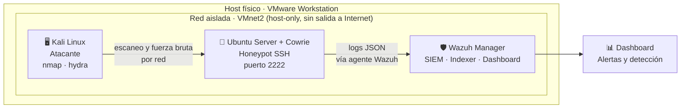
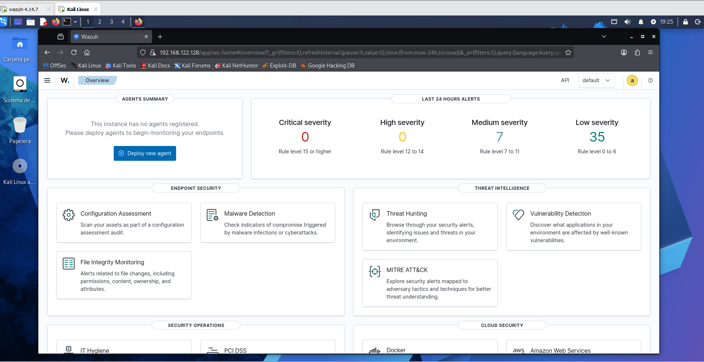
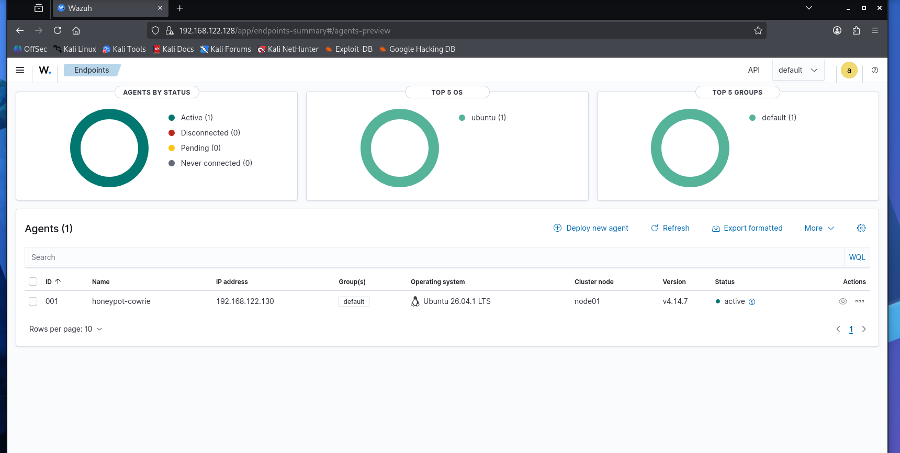
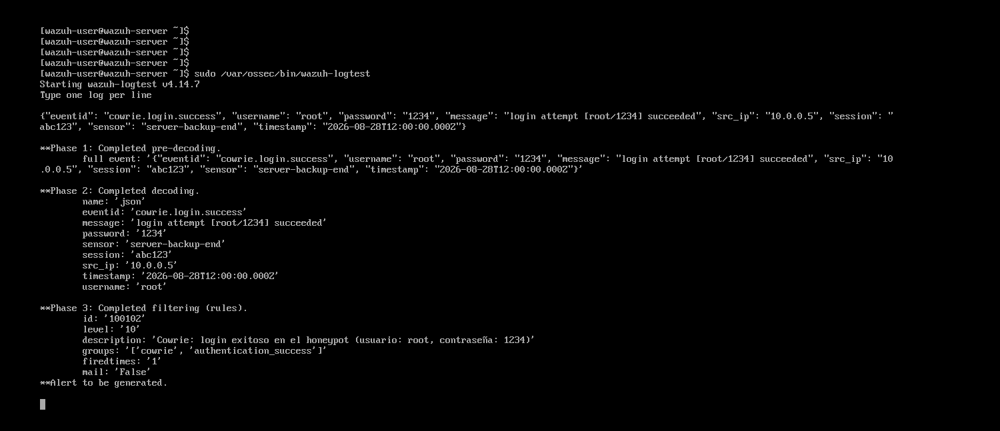
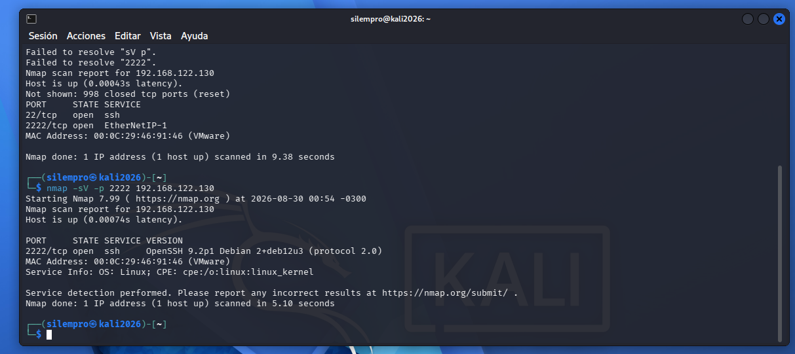
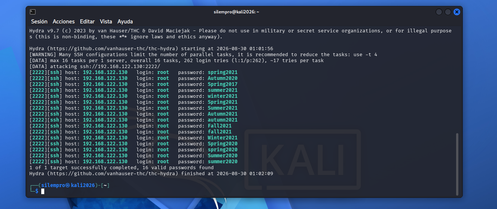
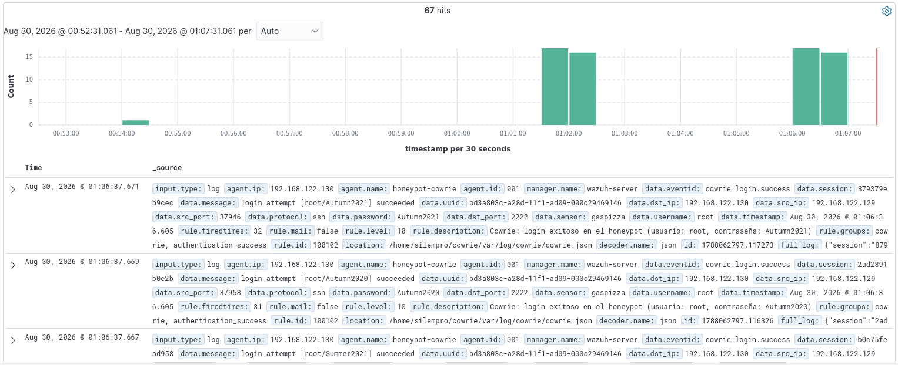

# 🍯 Laboratorio de Detección: Honeypot SSH + SIEM Wazuh

Proyecto de laboratorio personal de ciberseguridad defensiva (Blue Team), construido desde cero en un entorno virtualizado aislado. Simula un ataque real contra un servidor SSH trampa (honeypot) y demuestra la detección de esa actividad mediante un SIEM open source, incluyendo reglas de correlación escritas a medida.

> 📌 Proyecto desarrollado como práctica personal para reforzar conceptos de virtualización, redes, honeypots y SIEM. Nivel: junior / en formación.

---

## 📋 Tabla de contenidos

- [Objetivo](#-objetivo)
- [Arquitectura](#-arquitectura)
- [Stack tecnológico](#-stack-tecnológico)
- [Diseño de red](#-diseño-de-red)
- [Componentes del laboratorio](#-componentes-del-laboratorio)
- [Reglas de detección personalizadas](#-reglas-de-detección-personalizadas)
- [Simulación del ataque](#-simulación-del-ataque)
- [Resultados](#-resultados)
- [Desafíos encontrados](#-desafíos-encontrados-y-cómo-se-resolvieron)
- [Aprendizajes](#-aprendizajes)
- [Próximos pasos](#-próximos-pasos)
- [Nota ética](#️-nota-ética)

---

## 🎯 Objetivo

Armar un entorno de laboratorio completo, de punta a punta, que permita:

1. Desplegar un **honeypot SSH** que simule un servidor real y capture actividad de "atacantes".
2. Desplegar un **SIEM (Wazuh)** que reciba, interprete y genere alertas sobre esa actividad.
3. Simular un **ataque real** (reconocimiento + fuerza bruta) contra el honeypot desde una máquina atacante separada, en una red completamente aislada.
4. Escribir **reglas de detección personalizadas**, ya que Wazuh no interpreta por defecto el formato de logs de Cowrie.

Todo el tráfico ocurre dentro de una red virtual aislada (host-only), sin exposición a internet — el objetivo es aprender el flujo completo de detección, no operar un honeypot público.

---

## 🏗️ Arquitectura



Tres máquinas virtuales independientes, cada una con un rol específico, comunicándose solo entre sí dentro de la misma subred aislada.

---

## 🧰 Stack tecnológico

| Categoría | Herramienta |
|---|---|
| Virtualización | VMware Workstation |
| Sistema atacante | Kali Linux |
| Sistema honeypot | Ubuntu Server (sin GUI) |
| Honeypot SSH | [Cowrie](https://github.com/cowrie/cowrie) |
| SIEM | [Wazuh](https://wazuh.com/) 4.14.7 (manager + indexer + dashboard, agente en el honeypot) |
| Reconocimiento | Nmap |
| Fuerza bruta | Hydra |
| Reglas de detección | XML custom rules (Wazuh ruleset) |

---

## 🌐 Diseño de red

Las tres VMs comparten una red **host-only** de VMware (`VMnet2`), sin conexión a la red física ni a internet. Esta decisión fue deliberada:

- Evita exponer un honeypot real a internet desde una IP doméstica (riesgo de atraer tráfico malicioso real hacia el router de casa).
- Permite generar ataques 100% controlados y reproducibles.
- Es suficiente para demostrar el flujo completo de detección sin los riesgos de un despliegue público.

Cada VM tomó una IP dentro del rango `192.168.122.0/24` vía DHCP de VMware.

---

## ⚙️ Componentes del laboratorio

### 🖥️ Kali Linux — Atacante
Instalación estándar con entorno Xfce. Usado exclusivamente para generar tráfico de ataque contra el honeypot: escaneo de puertos con `nmap` y ataque de diccionario con `hydra`.

### 🍯 Ubuntu Server + Cowrie — Honeypot
Ubuntu Server mínimo (sin interfaz gráfica) corriendo [Cowrie](https://github.com/cowrie/cowrie), un honeypot de SSH/Telnet en Python que simula ser un servidor Linux real:

- Corre en un entorno virtual de Python (`venv`), como usuario sin privilegios — nunca como root.
- Configurado con un hostname falso (`server-backup-end`) para parecer un servidor de producción.
- Escucha en el puerto **2222**, simulando el banner real de OpenSSH (confirmado por `nmap -sV`, que lo identificó como un servidor SSH genuino).
- Acepta credenciales según lo definido en `userdb.txt`, registrando cada intento de login y cada comando ejecutado por el "atacante" en un log estructurado en formato **JSON**.

### 🛡️ Wazuh — SIEM
Desplegado mediante el OVA oficial (manager + indexer + dashboard integrados en una sola VM). Un **agente Wazuh** se instaló en la VM del honeypot para leer el log JSON de Cowrie y reenviar cada evento al manager.

Configuración clave en el agente (`/var/ossec/etc/ossec.conf`):

```xml
<localfile>
  <log_format>json</log_format>
  <location>/home/<usuario>/cowrie/var/log/cowrie/cowrie.json</location>
</localfile>
```

---

## 🔍 Reglas de detección personalizadas

Wazuh no trae, por defecto, ninguna regla que entienda el formato específico de eventos de Cowrie (`eventid: cowrie.login.success`, `cowrie.command.input`, etc.). Sin reglas propias, los eventos llegaban al manager pero **no generaban ninguna alerta** — quedaban invisibles en el dashboard.

Se escribieron reglas personalizadas en `local_rules.xml`, aprovechando que Wazuh decodifica automáticamente cualquier log en formato JSON:

```xml
<group name="cowrie,">

  <rule id="100100" level="3">
    <decoded_as>json</decoded_as>
    <field name="eventid">^cowrie\.session\.connect$</field>
    <description>Cowrie: nueva conexión al honeypot desde $(src_ip)</description>
  </rule>

  <rule id="100101" level="5">
    <decoded_as>json</decoded_as>
    <field name="eventid">^cowrie\.login\.failed$</field>
    <description>Cowrie: intento de login fallido (usuario: $(username))</description>
    <group>authentication_failed,</group>
  </rule>

  <rule id="100102" level="10">
    <decoded_as>json</decoded_as>
    <field name="eventid">^cowrie\.login\.success$</field>
    <description>Cowrie: login exitoso en el honeypot (usuario: $(username), contraseña: $(password))</description>
    <group>authentication_success,</group>
  </rule>

  <rule id="100103" level="7">
    <decoded_as>json</decoded_as>
    <field name="eventid">^cowrie\.command\.input$</field>
    <description>Cowrie: comando ejecutado por el atacante: $(input)</description>
  </rule>

  <rule id="100104" level="12" frequency="5" timeframe="120">
    <if_matched_sid>100101</if_matched_sid>
    <same_field>src_ip</same_field>
    <description>Cowrie: posible fuerza bruta SSH - 5 intentos fallidos en 2 minutos desde la misma IP ($(src_ip))</description>
    <mitre>
      <id>T1110</id>
    </mitre>
  </rule>

</group>
```

Cada regla fue validada con `wazuh-logtest` antes de probarla contra tráfico real, para confirmar que el nivel de severidad y la descripción se generaban correctamente.

---

## 💥 Simulación del ataque

Ejecutado íntegramente desde Kali, contra la IP del honeypot dentro de la red aislada:

**1. Reconocimiento con Nmap**
```bash
nmap -sV -p 2222 <IP_DEL_HONEYPOT>
```
Resultado: Cowrie fue identificado (incorrectamente, por diseño) como un servidor OpenSSH real — evidencia de que la simulación del banner funciona.

**2. Fuerza bruta con Hydra**
```bash
hydra -l root -P /usr/share/wordlists/fasttrack.txt ssh://<IP_DEL_HONEYPOT>:2222
```
Ataque de diccionario contra el usuario `root`, generando múltiples intentos de login reales por red (no simulados por loopback).

---

## 📊 Resultados

*(Espacio para las capturas de pantalla del proyecto — se sugiere crear una carpeta `screenshots/` en el repositorio y enlazarlas así):*

```markdown






```

En resumen, se logró:
- Un ataque real por red (no loopback) contra el honeypot.
- Detección completa del ataque en el dashboard de Wazuh, con reglas propias.
- Trazabilidad total: IP de origen, usuario y contraseña probados, comandos ejecutados por el "atacante" dentro de la sesión falsa.

---

## 🧩 Desafíos encontrados (y cómo se resolvieron)

| Desafío | Solución |
|---|---|
| Instalador de Kali fallaba por falta de RAM/disco | Se ajustaron los recursos de la VM (RAM y tamaño de disco) antes de reinstalar |
| Cambios en la estructura del repo de Cowrie (`etc/cowrie.cfg.dist` movido) | Se localizó el archivo correcto con `find` y se ajustó la ruta de copiado |
| El comando `bin/cowrie` no existía en la versión actual | Se identificó que hacía falta `pip install -e .` para generar el entry point `cowrie` como paquete instalado |
| Problemas de teclado en VMs sin entorno gráfico (símbolos `-`, `=`, `~`, `@` mal interpretados al pegar) | Se resolvió conectando por SSH desde una terminal nativa (PowerShell) en vez de la consola de VMware |
| Eventos de Cowrie no generaban alertas en Wazuh | Se identificó que faltaban reglas de detección personalizadas (Wazuh no tiene ruleset por defecto para Cowrie); se escribieron y validaron con `wazuh-logtest` |
| VMs en redes virtuales distintas (VMnet2 vs NAT) impedían la comunicación | Se verificó la configuración de red de cada VM individualmente hasta encontrar la inconsistencia |

---

## 🧠 Aprendizajes

- Diseño y aislamiento de redes virtuales en VMware (host-only networking).
- Instalación y hardening básico de un honeypot (Cowrie) corriendo sin privilegios.
- Arquitectura cliente-servidor de un SIEM (agente ↔ manager ↔ indexer ↔ dashboard).
- Diferencia entre **eventos recibidos** y **alertas generadas** en un SIEM — y por qué no es lo mismo.
- Escritura de reglas de correlación personalizadas en formato XML (Wazuh ruleset).
- Uso de herramientas ofensivas básicas (`nmap`, `hydra`) desde una perspectiva defensiva, para validar detecciones.
- Troubleshooting metódico en un entorno real, con múltiples capas (red, sistema operativo, aplicación).

---

## 🔭 Próximos pasos

- [ ] Convertir Cowrie en un servicio de `systemd` para que arranque automáticamente.
- [ ] Sumar un segundo honeypot (por ejemplo, con distinto servicio simulado) para correlacionar ataques.
- [ ] Habilitar el índice de *archives* de Wazuh para conservar todo el tráfico, no solo lo que dispara alertas.
- [ ] Agregar reglas de detección basadas en umbrales de frecuencia más sofisticados (ej. por rango de IP, no solo IP exacta).
- [ ] Documentar el mapeo a MITRE ATT&CK de cada regla.

---

## ⚠️ Nota ética

Este laboratorio se ejecuta íntegramente en una red virtual aislada, sin conexión a internet ni exposición pública. Las herramientas ofensivas (`nmap`, `hydra`) se usaron exclusivamente contra un sistema propio, dentro de un entorno controlado, con fines educativos. No se realizó ningún tipo de actividad contra sistemas de terceros.

---

## 👤 Autor

Proyecto personal de práctica — parte de mi portfolio de ciberseguridad.
